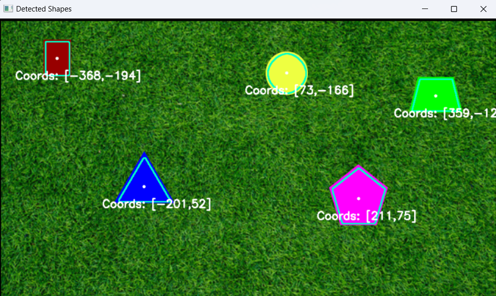

## Shape Detection for Aerial Images

This Python code detects shapes in images and videos.

### Requirements

- Python 3.x
- OpenCV (cv2)
- NumPy

### Installation

1. Install the required libraries using pip:

   ```bash
   pip install opencv-python numpy
   ```

### Usage

#### Image

1. **Place your image file in the same directory as the `ShapeDetection.py` script.** 

2. **Open a terminal or command prompt and navigate to the directory containing the script.**

3. **Run the script, providing the image filename as an argument:**

   ```bash
   python ShapeDetection.py <image_filename>
   ```

   Replace `<image_filename>` with the actual name of your image file (e.g., `shapes.png`).

#### Video

1. **Place your video file in the same directory as the `VideoDetection.py` script.** 

2. **Open a terminal or command prompt and navigate to the directory containing the script.**

3. **Run the script, providing the image filename as an argument:**

   ```bash
   python VideoDetection.py <video_filename>
   ```

   Replace `<video_filename>` with the actual name of your video file (e.g., `shapes.mp4`).

### Deliverables

1. **Static Image Results**



2. **Video Results**

<video controls src="VideoResults/videoShapesResult.mp4" title="Title"></video>

3. **Background Agnostic Results**

<video controls src="VideoResults/videoShapesResult.mp4" title="Title"></video>

4. **Development Discussion**

(label)https://docs.google.com/presentation/d/1GYJreKhcHUseBizNF0r581U3tSnnfnh828g7DOM6Q5M/edit?usp=sharing